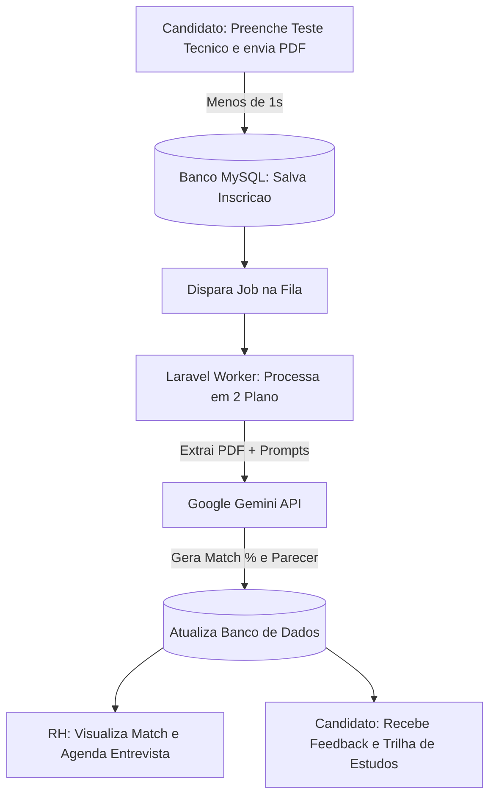

# Triagem SENAI — Sistema Inteligente de Seleção e Avaliação de Candidaturas

> **Projeto desenvolvido exclusivamente para a dinâmica de recrutamento e seleção do curso Técnico em Administração do SENAI.**

[](https://laravel.com)
[](https://php.net)
[](https://ai.google.dev/)
[](https://www.mysql.com)
[](https://railway.app)
[](https://tailwindcss.com)

---

## 📌 Sobre o Projeto

O **Triagem SENAI** é uma solução web *full-stack* desenvolvida especialmente para **otimizar e simular a dinâmica de recrutamento e seleção do curso Técnico em Administração do SENAI**.

O sistema combina **testes de conhecimentos técnicos** com análise preditiva de currículos via **Inteligência Artificial (Google Gemini)**, permitindo que a equipe de RH analise candidatos com agilidade, imparcialidade e riqueza de dados.

---

## 🔄 Fluxo Completo de Funcionamento



1. **Inscrição & Teste do Aluno:** O candidato responde ao questionário de conhecimentos técnicos direcionado à vaga e realiza o upload do currículo em PDF.
2. **Processamento Assíncrono:** O sistema registra a candidatura no banco de dados instantaneamente e delega o processamento da IA para uma fila em segundo plano.
3. **Análise com Gemini IA:** O worker lê o PDF do currículo, cruza as informações com o desempenho no teste técnico e gera um diagnóstico preditivo.
4. **Painel do Recrutador:** O RH visualiza o *Match %*, nível recomendado, parecer da IA e interface para agendamento de entrevistas com data e local.
5. **Feedback & Trilha de Aprendizagem:** O aluno acompanha o status da candidatura e recebe recomendações automáticas de cursos do SENAI para aprimorar seu perfil.

---

## ✨ Principais Funcionalidades

### 👨‍🎓 Para o Candidato
- **Upload de Currículo (PDF):** Envio rápido de documentos em formato PDF.
- **Avaliação Técnica Direcionada:** Teste de conhecimentos práticos focado em Administração/Automação.
- **Match & Diagnóstico em Tempo Real:** Visualização da porcentagem de compatibilidade e nível técnico sugerido.
- **Trilha de Estudos Inteligente:** Recomendações personalizadas de cursos e portais sugeridos pela IA.

### 💼 Para o Recrutador / RH
- **Dashboard Centralizado:** Filtros por vagas e status das candidaturas.
- **Parecer Técnico da IA:** Diagnóstico descritivo destacando pontos fortes e lacunas do candidato.
- **Categorização Automática:** Classificação em `Básico`, `Técnico` ou `Avançado`.
- **Módulo de Agendamento:** Interface para marcar data, horário e sala/local de entrevistas.

---

## 🛠️ Tecnologias Utilizadas

- **Core & Backend:** PHP 8.2+, Laravel 12.x
- **Frontend & Interface:** Blade Templates, Tailwind CSS, Alpine.js
- **Banco de Dados:** MySQL 8.0+
- **Inteligência Artificial:** Google Gemini API (Gemini Flash / Pro)
- **Processamento de Documentos:** `smalot/pdfparser`
- **Filas & Workers:** Laravel Queues (`database` driver)
- **Hospedagem & Deploy:** Railway (Arquitetura Multi-Serviço: Web + MySQL + Worker)

---

## ⚙️ Instalação e Configuração Local

### Pré-requisitos
- PHP >= 8.2
- Composer
- Node.js & NPM
- Servidor MySQL rodando localmente

### Passo a Passo

1. **Clonar o Repositório:**
   ```bash
   git clone [https://github.com/GustavoMessiasDeAzevedo/TriagemSenai.git](https://github.com/GustavoMessiasDeAzevedo/TriagemSenai.git)
   cd TriagemSenai
   ```

2. **Instalar Dependências PHP e JS:**
   ```bash
   composer install
   npm install && npm run build
   ```

3. **Configurar as Variáveis de Ambiente:**
   Copie o arquivo `.env.example` e gere a chave da aplicação:
   ```bash
   cp .env.example .env
   php artisan key:generate
   ```

4. **Configurações Essenciais do `.env`:**
   Abra o arquivo `.env` e configure o banco de dados, a fila e a chave da API do Gemini:
   ```env
   APP_NAME="Triagem SENAI"
   APP_URL=http://localhost:8000

   # Configurações do Banco de Dados
   DB_CONNECTION=mysql
   DB_HOST=127.0.0.1
   DB_PORT=3306
   DB_DATABASE=triagem_senai
   DB_USERNAME=root
   DB_PASSWORD=sua_senha

   # Configuração de Fila (Obrigatório 'database' para processamento em 2º plano)
   QUEUE_CONNECTION=database

   # Chave de API do Google Gemini (Obrigatória para análise de IA)
   GEMINI_API_KEY=sua_chave_api_do_google_gemini
   ```

5. **Executar Migrations e Storage Link:**
   ```bash
   php artisan migrate
   php artisan storage:link
   ```

6. **Iniciar o Servidor de Desenvolvimento:**
   Em um terminal:
   ```bash
   php artisan serve
   ```

7. **Iniciar o Worker da Fila (Obrigatório para processar o Gemini):**
   Em outro terminal:
   ```bash
   php artisan queue:work
   ```

---

## 🚀 Arquitetura de Deploy em Produção (Railway)

O projeto está hospedado no Railway utilizando uma estrutura isolada de 3 serviços para garantir alta disponibilidade e zero travamentos:

* **Serviço 1 — MySQL Database:** Banco relacional em nuvem.
* **Serviço 2 — Web Application (`TriagemSenai`):** Servidor HTTP que recebe os acessos do público.
  - *Start Command:*
    ```bash
    php artisan storage:link --force && php artisan migrate --force && php artisan serve --host=0.0.0.0 --port=$PORT
    ```
* **Serviço 3 — Laravel Worker (`Laravel Worker`):** Container dedicado exclusivamente para consumir a fila de tarefas e chamar a API do Gemini.
  - *Start Command:*
    ```bash
    php artisan queue:work --tries=3 --timeout=120
    ```

---

## 📄 Licença

Este projeto foi desenvolvido para fins acadêmicos e institucionais na dinâmica do curso **Técnico em Administração do SENAI**.
